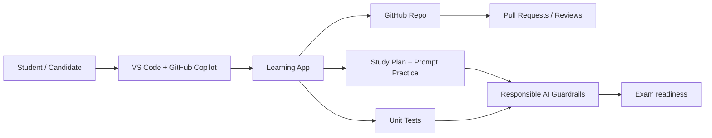

# Architecture and topology

## Topology summary
- Source of truth: this workspace and its GitHub repository.
- Daily workflow: write code, ask Copilot, validate output, and commit changes.
- Quality loop: tests, review, and documentation support continuous learning.
- Exam preparation: prompts, theory notes, and practice scenarios are all in one place.
